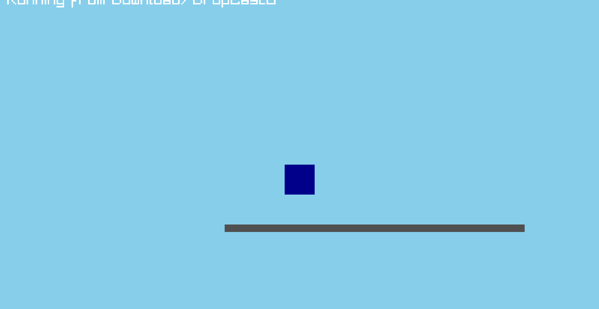
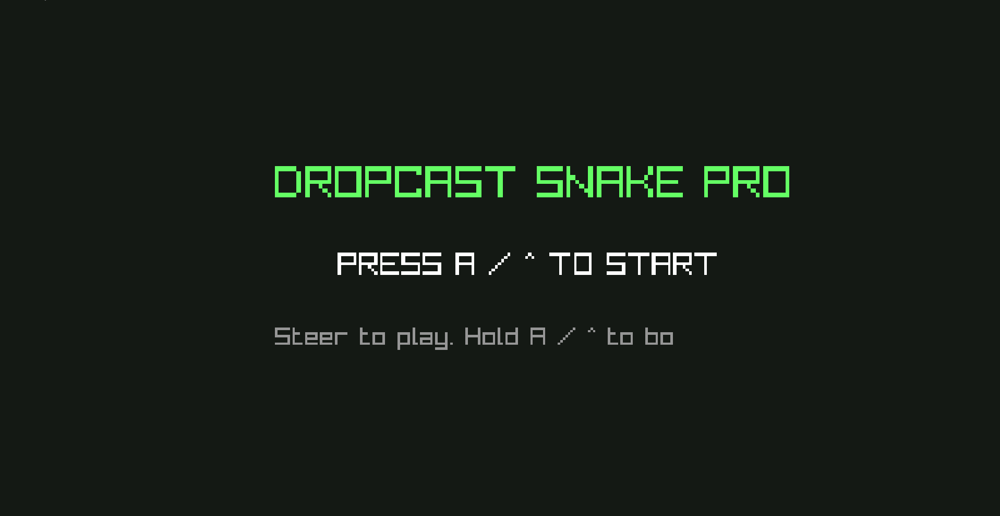
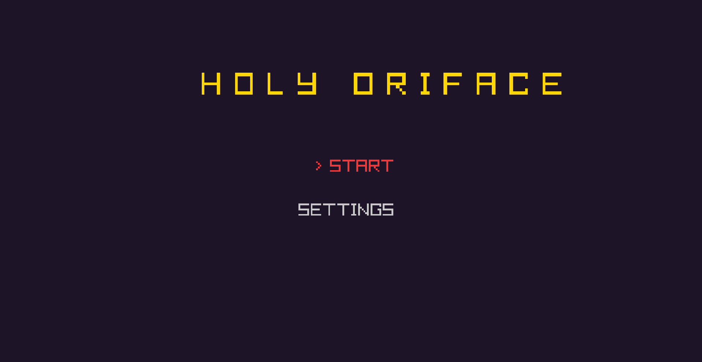

 ### Objective
using UDP (_User Datagram Protocol_) the host sends the game to the client. The host also acts as a controller for the game, so the client can be as lightweight as possible.  
  
  
## Games
### Jump
jump is a demo that I used to test latency  

### Snake
Snake was a game that I _vibecoded_ to test multigame implementation, as well as profile swapping.  

### holyOriface
HolyOrifice is the first real game I am working on for dropcast. I might make a separate github for it.  

## Menu
  
### Library
 Where you can choose your games  
### Settings
 Where you manage connection  
### User
 Where you can change profiles  

## Profiles
I want devlopers to be able to design custom controller profiles for different games, and for those profiles to be semi-compatible with other games.

